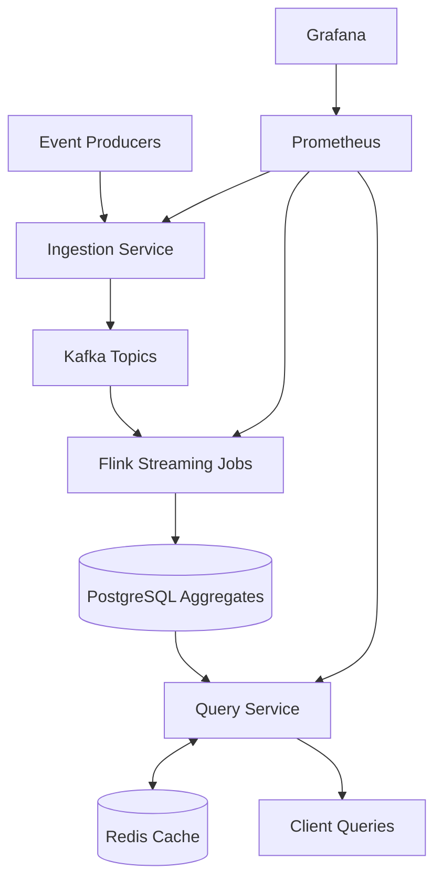
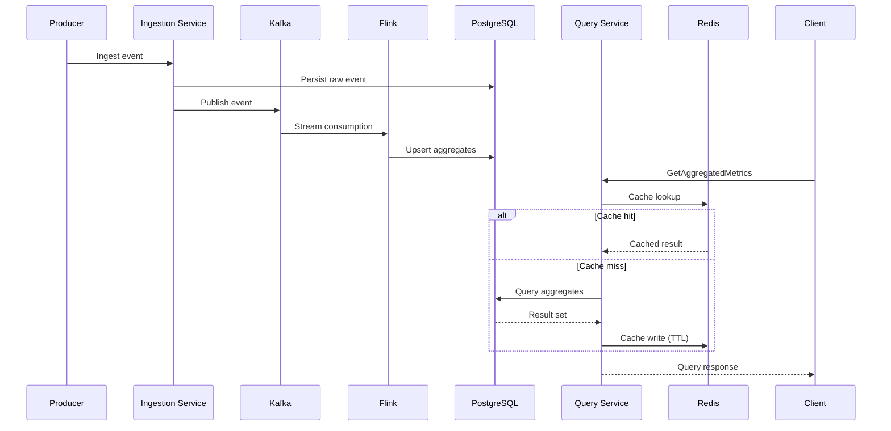

# Accelerated OLAP Query Layer for Event Data

A production-ready distributed analytics platform that ingests event streams, computes OLAP aggregates, and serves low-latency query responses.

## Table of Contents

- [Overview](#overview)
- [What This System Delivers](#what-this-system-delivers)
- [Architecture](#architecture)
- [Coordination and Cluster Management](#coordination-and-cluster-management)
- [Services](#services)
- [Data and Query Flow](#data-and-query-flow)
- [APIs](#apis)
- [Storage Layer](#storage-layer)
- [Observability and SLOs](#observability-and-slos)
- [Performance Profile](#performance-profile)
- [Local Deployment](#local-deployment)
- [Kubernetes Deployment](#kubernetes-deployment)
- [Batch and Refresh Workflows](#batch-and-refresh-workflows)
- [Repository Layout](#repository-layout)

## Overview

Accelerated OLAP Query Layer for Event Data is designed for high-throughput event analytics by combining:

- Event ingestion over gRPC
- Kafka-based stream decoupling
- Flink-based streaming aggregation
- PostgreSQL-backed aggregate serving store
- Redis-based hot-query acceleration
- Distributed microservice runtime with Docker and Kubernetes

The platform targets low-latency aggregate reads, high ingestion throughput, and stable query behavior under sustained mixed workloads.

## What This System Delivers

- Unified processing for transaction and activity event streams
- Streaming OLAP aggregation pipeline (Kafka + Flink)
- Cache-accelerated query serving (Redis cache-aside)
- gRPC-first service interfaces for low-overhead internal communication
- REST utility endpoints for operational controls and health checks
- Containerized local and Kubernetes deployment models
- Prometheus metrics and Grafana dashboards for runtime observability

## Architecture



Runtime layering:

- Processing layer: ingestion, event bus, streaming aggregation
- Serving layer: aggregate storage, query API, cache acceleration
- Platform layer: orchestration, metrics collection, dashboarding

## Coordination and Cluster Management

Coordination responsibilities in this architecture:

- `Kafka` manages ordered durable stream partitions and producer/consumer coordination.
- `Flink` coordinates distributed stream execution through JobManager/TaskManager roles.
- `Kubernetes` orchestrates service deployments, probes, scaling behavior, and service networking.

Operationally, data-plane services scale independently while stream and storage dependencies are coordinated through cluster primitives.

## Services

Core services in the platform:

- `ingestion-service`: validates and ingests transaction/activity events, publishes to Kafka
- `aggregation-service`: manages aggregate computation workflows and persistence integration
- `query-service`: serves aggregate queries with cache-aside optimization
- `cache-service`: Redis-backed cache API over gRPC/REST operations
- `activity-service`: synthetic workload generation for transactions and activities
- `common`: shared DTO/utilities used by multiple services

Infrastructure services:

- `postgres`
- `redis`
- `kafka`
- `flink-jobmanager`
- `flink-taskmanager`
- `prometheus`
- `grafana`

## Data and Query Flow

Ingestion and aggregation flow:

1. Producer sends transaction/activity events to ingestion APIs.
2. Ingestion service validates and persists raw records.
3. Ingestion service publishes normalized events to Kafka topics.
4. Flink jobs consume topics and compute time-windowed aggregates.
5. Aggregates are persisted into PostgreSQL serving tables.

Query flow:

1. Client sends aggregate query request.
2. Query service checks Redis cache.
3. On cache miss, query service reads PostgreSQL aggregate tables.
4. Query service writes fresh response to Redis with TTL.
5. Query service returns response stream to client.



## APIs

### REST

- `POST /api/ingest/event` - event ingestion endpoint
- `POST /api/aggregate/run` - aggregation execution trigger
- `GET /api/aggregate/status` - aggregation workflow status
- `GET /api/query/transactions/{userId}` - transaction-oriented query endpoint
- `GET /api/query/activities/{userId}` - activity-oriented query endpoint
- `GET /api/cache/get/{key}` - cache lookup
- `POST /api/cache/set/{key}` - cache write
- `DELETE /cache/invalidate/{key}` - cache invalidation

Example:

```bash
curl -X POST "http://localhost:8081/api/aggregate/run?inputPath=/stream/input&outputPath=/stream/output"
```

### gRPC

Primary gRPC contracts:

- `ingestion.IngestionService`
  - `IngestTransaction`
  - `IngestActivity`
- `aggregation.AggregationService`
  - `RunAggregation`
  - `GetAggregatedMetrics`
- `query.QueryService`
  - `GetAggregatedMetrics`
- `cache.CacheService`
  - `Get`
  - `Set`
  - `Invalidate`

Proto definitions:

- `ingestion-service/src/main/proto/ingestion.proto`
- `aggregation-service/src/main/proto/aggregation.proto`
- `query-service/src/main/proto/query.proto`
- `cache-service/src/main/proto/cache.proto`
- `activity-service/src/main/proto/activity.proto`

## Storage Layer

- PostgreSQL: raw event records and aggregate metric tables
- Redis: low-latency query cache for repeated aggregate requests
- Kafka: durable event log for streaming compute pipeline

Representative entities:

- `transaction`
- `activity_log`
- `aggregated_metrics`

## Observability and SLOs

Observability assets:

- Prometheus scrape config: `monitoring/prometheus.yml`
- Grafana datasource config: `monitoring/grafana_datasource.yml`

Key runtime metrics:

- ingest request volume/rate
- stream processing lag and throughput
- aggregate query latency (p50/p95/p99)
- cache hit/miss ratio
- service error rates

Primary service objectives:

- Low-latency aggregate query path
- Stable error rate under sustained load
- Predictable end-to-end freshness from ingest to query visibility

## Performance Profile

Validated benchmark profile:

- Concurrent event ingestion workload
- Cached vs uncached query latency characterization
- Aggregate freshness lag measurement
- Sustained mixed read/write load profile

Benchmark assets:

- `benchmarks/ingestion_benchmark.json`
- `benchmarks/aggregation_benchmark.json`
- `benchmarks/query_benchmark.json`
- `benchmarks/activity_benchmark.json`
- `benchmarks/bulk_activity_benchmark.json`

## Local Deployment

Prerequisites:

- Java 17+
- Maven 3.9+
- Docker + Docker Compose

Build and run:

```bash
git clone https://github.com/Arup-Chauhan/Unified-Transaction-Activity-Processing-Engine.git
cd Unified-Transaction-Activity-Processing-Engine
mvn clean package
docker compose --env-file .env up --build -d
```

Stop local stack:

```bash
docker compose down
```

## Kubernetes Deployment

Kubernetes manifests are available under `k8s/` for:

- application services
- stateful data services
- stream-processing runtime
- monitoring components

Deploy:

```bash
kubectl apply -f k8s/
```

## Batch and Refresh Workflows

Batch and refresh workflows are used for:

- aggregate backfill and recomputation
- cache refresh and invalidation cycles
- quality/reconciliation passes on derived metrics

Design boundary:

- Streaming path handles near-real-time compute.
- Batch workflows handle replay, correction, and large-window recomputation.

## Repository Layout

- `activity-service/`
- `aggregation-service/`
- `benchmarks/`
- `cache-service/`
- `common/`
- `ingestion-service/`
- `k8s/`
- `monitoring/`
- `proto/`
- `query-service/`
- `scripts/`
- `docker-compose.yml`
- `pom.xml`
